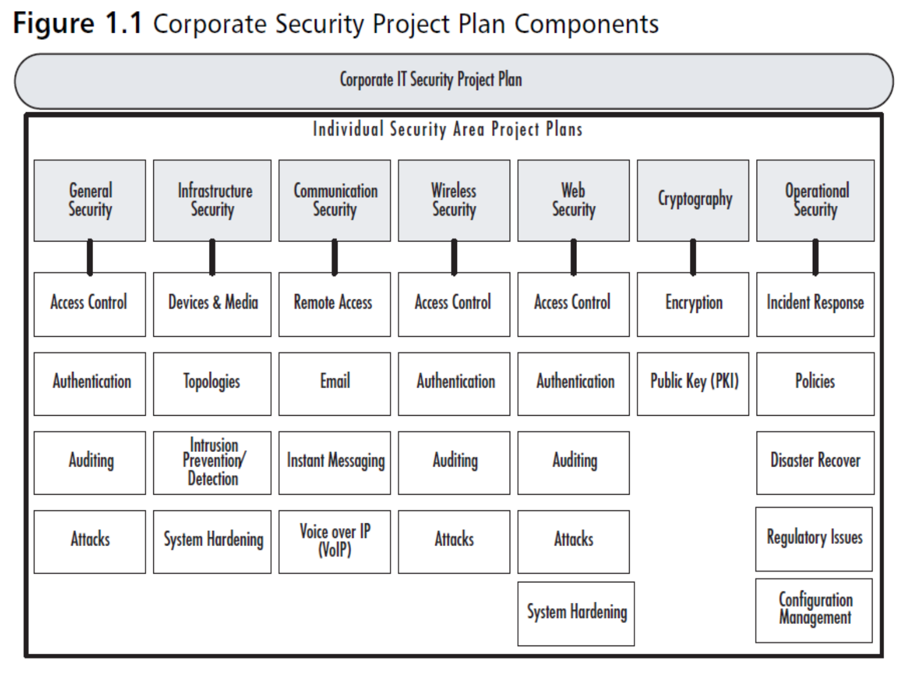

# Chapter 2 Identifying Security Project

## Index
* [Chapter 2 Identifying Security Project](#chapter-2-identifying-security-project)
  * [Index](#index)
  * [True cost of security](#true-cost-of-security)
    * [Consequences of Cyber Security Issues](#consequences-of-cyber-security-issues)
  * [Three expenses when a security breach occurs](#three-expenses-when-a-security-breach-occurs)
    * [Calculations](#calculations)
  * [Five steps of operational security](#five-steps-of-operational-security)
  * [ROSI (Return on Security Investment)](#rosi-return-on-security-investment)
  * [Project Constraints](#project-constraints)
    * [Relationship between Constraints](#relationship-between-constraints)
  * [Project Success Factors](#project-success-factors)
  * [Individual Security Area Project (ISAP) Plan](#individual-security-area-project-isap-plan)

## True cost of security
- Data needs to be secured
- it provides a competitive advantage
- it's confidential personal information such as credit card data or social security numbers
- there is always someone out there looking to a new way in.
- Most common is the inside job
  - disgruntled employees
  - unsuspecting users
  - outside contractors with insider access

### Consequences of Cyber Security Issues
- Economic lost
- Reputation Damage 
- Consequences on Legal Ground

## Three expenses when a security breach occurs
- the IT staff time
- the productivity of people trying to use the network
- more intangible costs to the company's reputation

### Calculations
Total IT hours = total hours spent by all staff involved
Cost = Total IT hours * average hourly rate

## Five steps of operational security
- Identify your sensitive data
- Identify possible threats
- Analyze security holes and other vulnerabilities
- Appraise the level of risk associated with each vulnerability
- Get countermeasures in place

## ROSI (Return on Security Investment)
- Single Loss Expectancy (SLE)
  - simply the expected amount of money, total cost, that is lost during a single security incident.
- Annual Rate of Occurrence (ARO)
  - ARO measures the likelihood or probability of a security incident occurring in a year.
- Annual Loss Expectancy (ALE)
  - ALE is the total annual financial loss to expect from a security incident.
  - ALE = SLE * ARO
- Modified Annual Loss Expectancy (mALE)
  - modified ALE is the same as above but with the addition of losses saved from implementing security solutions.

- Return on Security Investment (ROSI)
  - ROSI = ((ALE) * mitigation rate - cost of solution) / cost of solution

## Project Constraints
1. Time
2. Quality 
3. Scope
4. Cost

### Relationship between Constraints
`Scope = Time * Cost * Quality`

## Project Success Factors
- Executive Support
- User Involvement
- Experienced Project Manager
- Clearly Defined and Smaller Project Scope
- Schedule and Multiple Milestones
- Clear Management Process
- Standard Infrastructure

## Individual Security Area Project (ISAP) Plan

[Back to Top](#chapter-2-identifying-security-project)

[Next Chapter](chapter3.md)
[Back to README](README.md)