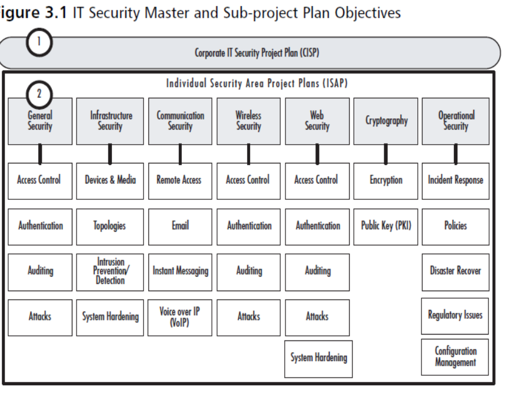

# Chapter 3 Organizing Information Security Projects

## Index
* [Chapter 3 Organizing Information Security Projects](#chapter-3-organizing-information-security-projects)
  * [Index](#index)
  * [Cyber Security Domains](#cyber-security-domains)
  * [Organizing Information Security Projects](#organizing-information-security-projects)
  * [Identifying the IT Security Project Team](#identifying-the-it-security-project-team)
    * [Team Leader Role](#team-leader-role)
  * [Identifying the IT Security Project Stakeholders](#identifying-the-it-security-project-stakeholders)
    * [Potential Stakeholders](#potential-stakeholders)
  * [Defining IT Security Project Requirements (Four Categories)](#defining-it-security-project-requirements-four-categories)
    * [User Requirements](#user-requirements)
    * [Departmental Requirements](#departmental-requirements)
    * [External User Requirements](#external-user-requirements)
    * [Corporate Requirements](#corporate-requirements)
    * [Governmental Regulation Requirements](#governmental-regulation-requirements)
    * [Project Constraints](#project-constraints)
    * [Method to Gather Requirements](#method-to-gather-requirements)
  * [Defining IT Security Project Objectives](#defining-it-security-project-objectives)
    * [Corporate IT Security Project (CISP) Objectives Sample](#corporate-it-security-project-cisp-objectives-sample)
    * [ISAP Objectives](#isap-objectives)

## Cyber Security Domains
1. Physical Security
2. Security Architecture
   - Cryptography
   - Secure System Build
   - Secure Application Development
   - Network Design
   - Data protection
   - Cloud Security
   - Access Control
   - Security Engineering
3. Risk Assessment
   - Source Code Scan
   - Vulnerability Scan
   - Assets Inventory
   - 3rd Party Risk 
   - Data-Centric Risk
   - Penetration Testing
4. Governance
   - Audit
   - Executive Management Involvement
   - Company's Written Supervisory Procedures (WSP)
5. Security Operations
   - Vulnerability Management
   - Protection
   - Data Leakage 
   - Detection
   - Prevention
   - Recovery
   - SIEM
   - SOC
   - Incident Response
   - Active Defense
6. Threat Intelligence
   - External
     - Contextual
   - Internal
     - Intel Sharing
7. User Education
   - Training
     - (new skills)
   - Awareness
     - (reinforcement)
8. Frameworks and Standards
   - NIST
   - ISO/IEC
   - COBIT
   - SANS/CSC
9.  Career Development
   - Conferences
   - Certification
   - Training
   - Peer Group
   - Self-Study

## Organizing Information Security Projects
1. Identify the IT Security Project Team
2. Identify the IT Security Project Stakeholders
3. Defining IT Security Project Requirements
4. Defining IT Security Project Objectives 
5. Defining IT Security Project Processes

## Identifying the IT Security Project Team
1. There are often two distinct groups within a project team: one helps with the definition phase and the other one implements the project.
2. A successful project, involves users and appropriate stakeholders early.
3. During the planning phases, key users should be selected for their ability to add value to the process, not for political purposes.
4. The more opportunities you can take to really understand what users need, the more effective your IT projects will be.
5. Create clear criteria for selecting the right people for the project.
6. Avoid inviting people that are not critical to a sucessful project.

### Team Leader Role
1. Informational role
  - Collecting, processing, and using information that can affect the completion of the objective
2. Interpersonal role
  - Interacting with superiors, subordinates, outside stakeholders, and other parties that influence or are influenced by the completion of the task
3. Decisional role
  - Selecting from among alternative approaches, and resolving conflicts, dilemmas, or challenges

## Identifying the IT Security Project Stakeholders
1. Stakeholders are people who are impacted by a project or who impact projects.
2. It is always a good idea to find out who may be impacted before going too far into the planning stage.
3. At the outset of the IT security project planning process, have a meeting with key members of every department that is present.
4. There are often key people outside of a project implementation team that should be included in both the planning and testing phases.
5. One way to categorize stakeholders for an IT security project is to determine who must be *involved*, who might be *infulential*, and who must be *informed*.
6. Finally, there is a group of stakeholders that should remain informed, which includes the executive team, and may also include key stakeholders who were part of the initial planning and who may need periodic updates to fulfill corporate or government reporting requirements.

|Internal to The project team|External to The project team but in the same organization|Totally External to the organization|
|---|---|---|
|They will under the direct managerial control of the project leader| The people and the departments from whom the project team may need assistance | The customers (for users) who will benefit from the system that the project implements, or contractor who will carry out the project work |

### Potential Stakeholders
1. IT Staff
2. User representatives
3. Human Resources
4. Finance
5. Legal
6. Departmental Managers
7. Regional or site managers

[Back to Top](#chapter-3-organizing-information-security-projects)

## Defining IT Security Project Requirements (Four Categories)
1. User
2. Business
3. Functional
4. Technical

### User Requirements
1. What do end users need to help maintain a secure network environment?

### Departmental Requirements
1. What do the various departments need for security ?
   - Huaman Resources needs tight security on personnel files
   - Accounting needs tight security on credit card numbers and company financials
   - Business Development may have specialized security needs related to staff that travels frequently

### External User Requirements
1. Are there vendors that need to connect to the network ?
   - Do you provide customers the ability to get real-time data online
   - Does your company allow employees to connect to the corporate network from home or on the road ?
   - How should these external connections be protected ?

### Corporate Requirements
1. Are there any corporate policies that can be interpreted as requirements for an IT security plan ?
   - put them in your security project plan

### Governmental Regulation Requirements
1. Is your organization subject to Sarbanes-Oxley (SOX) regulations, Health Insurance Portability and Accountability Act (HIPAA), or any other governmental regulations that could impact your IT security project plan ?

### Project Constraints
1. Scope
2. Time
3. Cost
4. Quanlity

### Method to Gather Requirements
1. hold an initial project meeting
2. Invite all potential stakeholders
3. Work with them to identify as many potential requirements as possible

## Defining IT Security Project Objectives
1. Create three or five major objectives
2. The corporate IT security project plans and the individual security project plans each have different objectives.
3. For ease of reference, they are referred to as the Corporate IT Security Project (CISP) and the Individual Security Area Project (ISAP).

1. Number 1 is the Corporate IT Security Project (CISP) 
2. Number 2 is the Individual Security Area Project (ISAP).
3. You will create a distinct set of objectives for each of your ISAP plans
4. Those objectives may overlap from one projeect to another.

### Corporate IT Security Project (CISP) Objectives Sample
1. Provide a comprehensive security management framework for the organization
2. Provide a clear and consistent set of corporate security policies.
3. Identify specific security areas to be reviewed and managed.
4. Create specific ISAP plans to manage the appropriate security elements within the company.

### ISAP Objectives 
1. Go into a deeper level of detail within the various security topic areas.
2. Use the sub-items listed below each header in the ISAP section as the starting point of your ISAP objectives.
   - These objectives can be stated as follows:
     - Review, define, and implement access controls on the network.
     - Review, define, and implement user and computer authentication.
     - Define and implement auditing policies and procedures.
     - Review vulnerabilities and develop prevention and coutermeasures against attacks.

[Back to Top](#chapter-3-organizing-information-security-projects)

[Next Chapter](chapter4.md)
[Back to README](README.md)