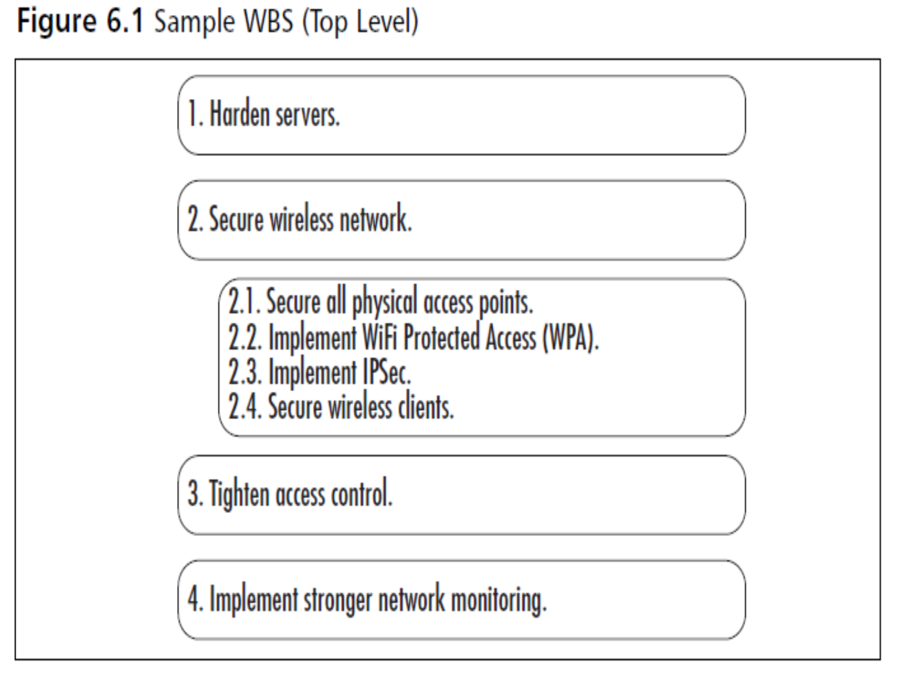
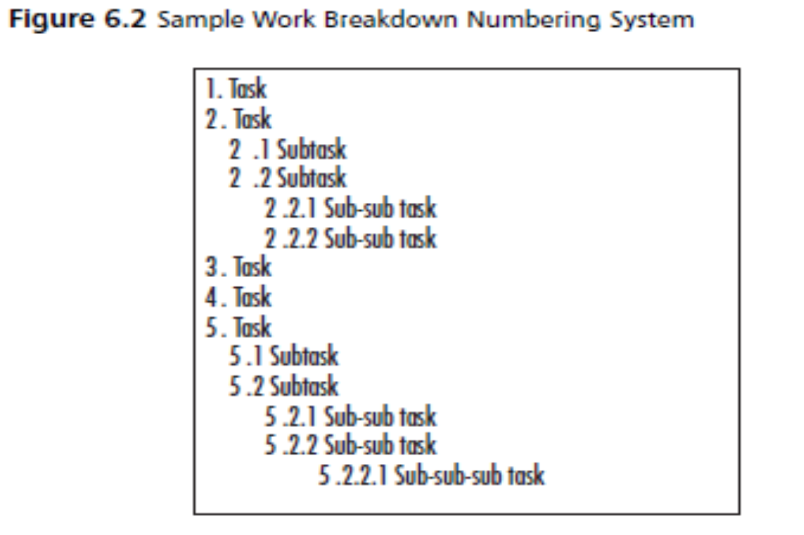

# Chapter 4 Project Plan
## Index
* [Chapter 4 Project Plan](#chapter-4-project-plan)
  * [Index](#index)
  * [Creating The IT Security Project Work Breakdown Structure (WBS)](#creating-the-it-security-project-work-breakdown-structure-wbs)
    * [Why is WBS important?](#why-is-wbs-important)
  * [Defining Project Tasks and Subtasks](#defining-project-tasks-and-subtasks)
  * [Checking Project Scope](#checking-project-scope)
  * [Developing Task Details](#developing-task-details)
    * [Owner](#owner)
    * [Resources](#resources)
    * [Completion Criteria](#completion-criteria)
    * [Schedule](#schedule)
    * [Budget](#budget)
    * [Dependencies](#dependencies)
    * [Constraints](#constraints)
      * [Expertise](#expertise)
      * [Tools](#tools)
      * [Budget](#budget-1)
      * [Organizational Change](#organizational-change)
      * [Governmental or Regulatory Requirements](#governmental-or-regulatory-requirements)
  * [Identifying and Working with the Critical Path](#identifying-and-working-with-the-critical-path)
    * [How to Calculate](#how-to-calculate)
      * [Notes](#notes)
  * [Testing IT Security Project Results](#testing-it-security-project-results)
    * [Testing Plan](#testing-plan)
      * [Comprehensive Testing Plan](#comprehensive-testing-plan)
      * [Common steps](#common-steps)
      * [Testing Types](#testing-types)

## Creating The IT Security Project Work Breakdown Structure (WBS)
1. WBS is like a "to-do" list
2. A list of all the major and minor tasks that need to be accomplished in a project.
3. Three to five major objectives can each be broken down into major tasks that, when completed, would achieve that particular objective.
4. A sample security WBS for an Information Technology (IT) security project plan shown in Figure below.

### Why is WBS important?
1. Cost Estimating 
2. Cost Budgeting
3. Resource Planning
4. Risk Management Planning
5. Activity Definition

## Defining Project Tasks and Subtasks
1. Tasks should use a verb/noun format.
   - Avoid using "Access control" as a task. Instead, use "Tighten access control" or "Implement access control." so the intent of the task is clear.
2. You can go down any number of levels, depending on the level of detail you want to define for each task.
   - There is a point of diminishing returns, so define a reasonable amount of detail. Additional detail can be defined and captured in the task's details.
3. Use a numbering system that makes sense to you. Example shown as figure blow.

## Checking Project Scope
1. Look at all the tasks and see if they fit within your defined project scope.
2. If you increase the scope of your project, what else must change?
3. If you increase your scope at this point, you'll have to renegotiate
4. Look at your security project plan and your WBS. Is there are any elements that are not crucial to the successful completion of the project.
5. Run the WBS by your security project plan sponsor and gain approval for your WBS and your scope.

## Developing Task Details
1. Focus on two types of details
   - the most commonly used task details
   - the details that specifically relate to IT security.
2. Guidelines that will help you develop really solid task details.
3. The person or group that will be performing the task is typically the best resource for helping to define task details.

### Owner
1. The first task detail that comes to mind is the *task owner*.
2. In an IT security project, you may choose to have securtiy area experts.
3. Assign one owner per task to maintain accountability and responsibility for task completion.

### Resources
1. Can be used to indicate anything needed for a security project
   - People
   - Money
   - Tools
   - Equipment
   - Software
   - Supplies
2. For each task, you should have the task owner (or a subject matter expert) define the resources needed for that task.
3. These two types of resources are used both in scheduling and in budgeting.
   - People
   - Supplies
4. Relying on your subject matter experts to help define the needed resources for tasks is critical.

### Completion Criteria
1. Completion criteria are the criteria by which you or anyone else can determine if a task was completed properly.
2. The task owner or the subject matter expert is the best person to create these completion criteria.
3. Reduce your chance of missing something important once the project is in full swing.
4. Any issue
   - functional
   - technical
   - legal
   - regulatory

### Schedule
1. Best practices in project management include the use of the 8/80 rule when defining the *schedule*.
   - you should not define any task that takes less that 8 hours, and no single task should take more than 80 hours.
2. Once you've created your IT security project plan's, you can begin estimating task duration.
   - Give you a high-level sense of your project's overall schedule length.

### Budget
1. Once you've defined your task, needed resources, and required expertise next is budget.
   - may need assistance from your finance department
   - help speed the process and make sure you don't overlook important budget components.

### Dependencies
1. dependencies determines the length of your schedule.
2. dependencies are linked to external events, you have additional challenges to consider
3. subject matter experts are a good source of data about dependencies.
4. Be sure to mark these dependencies in the relevant tasks, and create milestones.

### Constraints
1. impact projects by limiting the approach or methods the team cna use to complete the project
2. can be internal or external to your department, division, or company.
3. Five elements that are likely found on many lists of constraints:
   - Expertise
   - Tools
   - Budget
   - Organizational change
   - Governmental or regulatory requirements

#### Expertise
1. need to figure out the best way to address that gap in lacking of depth and breadth of expertise.
2. If expertise is in short supply, difficult to locate, or very expensive, addressed with your security project plan sponsor.

#### Tools
1. Sometimes tools can be a constraint, especially if one of your subject matter experts recommends (or requires) a particular tool and your budget can't accommodate it.
2. If there's a piece of equipment that you share with another department, or a piece of equipment you need to rent or lease, list this as a constraint as well, since it could impact the ability of your project team to move on to specific tasks that require the use of this tools or equipment.

#### Budget
1. Is a *budget* ever large enough ? Probably not, but in the world of IT security, a skimpy budget may translate into network vulnerabilty or, even more importantly, legal liability.
2. Sometimes the issue isn't the total amount of money, but the timing of the funds.
3. If you're really on top of your game, you will prepare a cash flow model for your project so that you can define when you'll need which amounts of capital.

#### Organizational Change
1. If your company is in the process of evaluating another company for acquisition, this might be a constraint on your security project.
2. While this scenario may not be relevant to your organization, take a look around your company and see if ther are any upcoming changes that could constrain on your project.

#### Governmental or Regulatory Requirements
1. In some case, these requirements might simply be included in the functional and technical requirements.
2. In other cases, these regulations might be constraints on the project as a whole.
3. Any governmental or regulatory requirement that limits the way your team approaches the project should be considered a constraint and should be listed.

## Identifying and Working with the Critical Path
1. By definition, the critical path is the longest, least flexible path through your project.
   - If any task on the critical path slips, the project will not be finished on time.
2. Understand the tasks, it will help you make better decisions about how to allocate resources to your project.
3. By identifying the crytical path, teams recognize the most important tasks to be performed in a project.

### How to Calculate
1. Obtain the project data. Make a list of all the activities of the project along with their dependencies and their specific times.
2. Elaborate the network diagram. We have written a post that explains how to elaborate the project network diagram step by step.
3. Calculate the Early Start (ES) and Late Start (LS) Times. Determine the Early Start (ES) and Late Start (LS) times for each activity.
4. Calculate the Early Finish (EF) and Late Finish (LF) Times. Determine the Early Finish (EF) and Late Finish (LF) times for each activity.
5. Calculate the slack time. The critical path must be determined by finding out the slack for each activity of the process. The activities where there is no slack are the ones making up the critical path.

#### Notes
- **Early Start (ES)**: It is equal to the activity's precedent. If it has more than one precedent, the highest value is taken.
- **Early Finish (EF)**: It is equal to the Early Start of the activity plus its duration (t). EF = ES + t.
- **Late Start (LS)**: It is equal to the Late Finish of the activity minus its duration (t). LS = LF - t.
- **Late Finish (LF)**: It is equal to the late start of the activity that follows. If it has more than one successor, the lowest value is taken.
- **Slack**: It can be calculated in two ways. S = LS - ES = LF - EF. Activities with zero clearance make up the critical path.

## Testing IT Security Project Results
1. may choose to develop a wholly independent testing plan.
2. may also choose to develop testing criteria within tasks or phases of your project.
3. planning should include testing procedures that test down (ISAPs) and across (corporate) the enterprise.

### Testing Plan 
#### Comprehensive Testing Plan
1. The people aspect has to do with testing how people can (and do) interact with network resources.
2. Process has to do with testing various security processes, whether through settings, automation, or interactive testing.
3. *Technology* has to do with verifying configuration, hardware, and software settings.

#### Common steps
1. Testing stage
2. Schedule of the test 
3. Location of the test
4. Participants in the test
5. Environment; general IT and equipment
6. Data to be used for testing
7. Backup and restore procedures
8. Testing procedure
9. Issue, problem, and error reporting procedure
10. Issue resolution procedure
11. Retesting procedure
12. Signoff procedure

#### Testing Types
1. Unit Testing
2. Integration Testing
3. Usability Testing
4. Acceptance Testing
5. Beta Testing
6. Regression Testing
7. Performance tesing (stress and load testing, stability testing, and reliability testing)
8. Benchmark testing

[Back to Top](#chapter-4-project-plan)

[Next Chapter](chapter5.md)
[Back to README](README.md)
